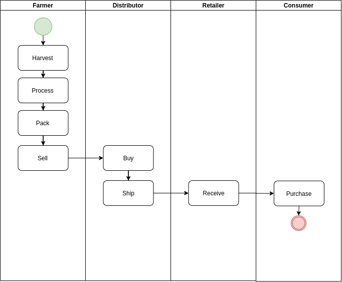
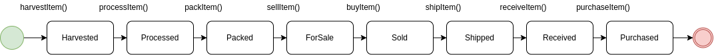
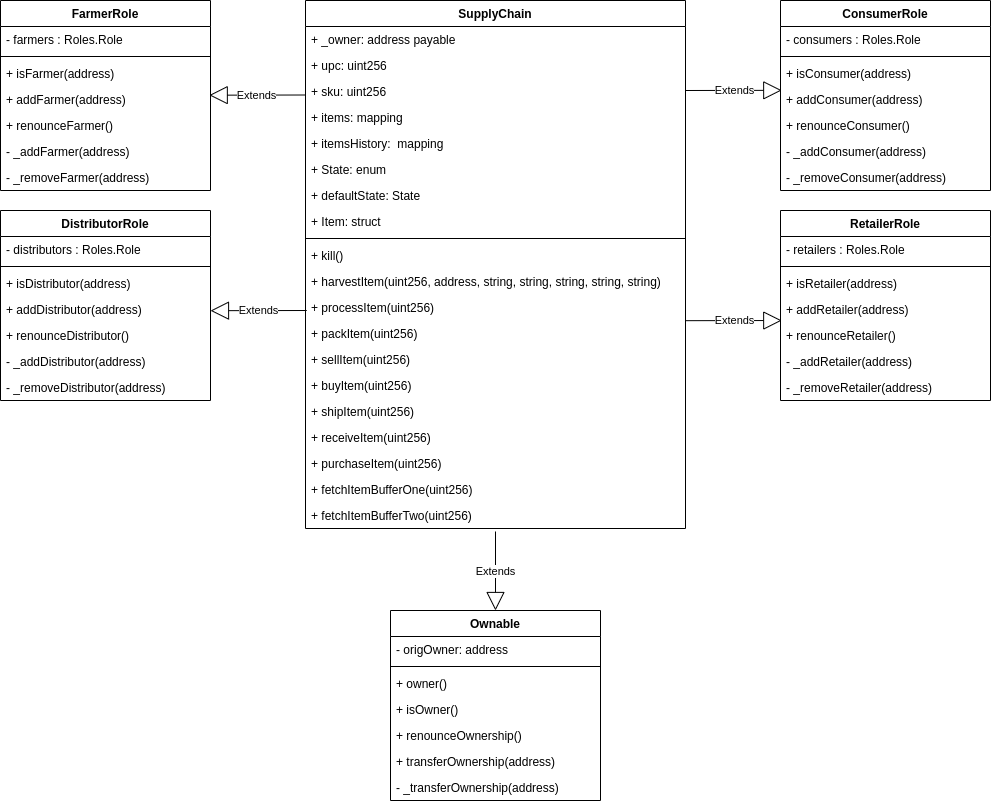

# Supply chain & data auditing

This repository containts an Ethereum DApp that demonstrates a Supply Chain flow between a Seller and Buyer. The user story is similar to any commonly used supply chain process. A Seller can add items to the inventory system stored in the blockchain. A Buyer can purchase such items from the inventory system. Additionally a Seller can mark an item as Shipped, and similarly a Buyer can mark an item as Received.

The DApp User Interface when running should look like...


## Architecture Diagrams

### Activity Diagram



### Sequence Diagram


### State Diagram



### Classes Diagram



## Deploy Proof

If you want to see the deployed contract in the Rinkeby test network, you can use the address

```
0x2484BC04298FC555e15eb87f9cfBaAeFD6676B49
```

Or go to its [etherscan url](https://rinkeby.etherscan.io/address/0x2484BC04298FC555e15eb87f9cfBaAeFD6676B49#events).

## Getting Started

These instructions will get you a copy of the project up and running on your local machine for development and testing purposes. See deployment for notes on how to deploy the project on a live system.

### Prerequisites

Please make sure you've already installed ganache-cli, Truffle and enabled MetaMask extension in your browser. It is recommended that you have `node v17.1.0` to run this project and set the legacy encryption provider in your terminal:

```bash
export NODE_OPTIONS=--openssl-legacy-provider
```

### Installing

> This code is written for **Solidity v0.8.0**. To use this code, please run `npm i -g truffle@5.4.21` to install Truffle. This code also uses `truffle-assertions` library to manage event listening for Solidity v0.8.0, which makes it easier to declare and manage.

A step by step series of examples that tell you have to get a development env running

Clone this repository:

```
git clone https://github.com/jmalovera10/bdp3-blockchain-architecture
```

Install all requisite npm packages (as listed in `package.json`):

```
cd project-6
npm install
```

Launch Ganache:

```
ganache-cli -m "spirit supply whale amount human item harsh scare congress discover talent hamster"
```

Your terminal should look something like this:


In a separate terminal window, Compile smart contracts:

```
truffle compile
```

Your terminal should look something like this:


This will create the smart contract artifacts in folder `build\contracts`.

Migrate smart contracts to the locally running blockchain, ganache-cli:

```
truffle migrate
```

Your terminal should look something like this:


Test smart contracts:

```
truffle test
```

All 10 tests should pass.


In a separate terminal window, launch the DApp:

```
npm run dev
```

### Deploying the Contract

To deploy the contract to the Rinkeby network be sure to create a `.secret` file in the root directory with your wallet mnemonic passphrase. Then in a terminal use truffle to deploy:

```bash
truffle migrate --network rinkeby
```

## Built With

- [Ethereum](https://www.ethereum.org/) - Ethereum is a decentralized platform that runs smart contracts
- [IPFS](https://ipfs.io/) - IPFS is the Distributed Web | A peer-to-peer hypermedia protocol
  to make the web faster, safer, and more open.
- [Truffle Framework](http://truffleframework.com/) - Truffle is the most popular development framework for Ethereum with a mission to make your life a whole lot easier.

## Authors

See also the list of [contributors](https://github.com/your/project/contributors.md) who participated in this project.

## Acknowledgments

- Solidity
- Ganache-cli
- Truffle
- IPFS
